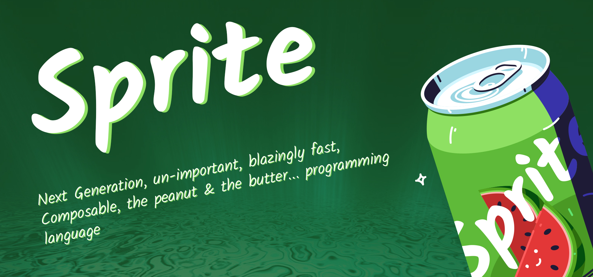

# Readme



A simple implementation of a language interpreter using golang.

## Setup Locally

I'm using [air](https://github.com/cosmtrek/air), it is a tool used to live reload your build.

```bash
# Create Air Initial Config
air init
# Config Done basically, run the app
air
```

Note: now you can see the build re-running when you make changes to the project.

## Why?

I just wanted to make something cool, plus I'm trying to learn something too. Which is a plus in my book. But if this goes *bang* into a huge success, don't point at me for making such a bad language :)

## Attributions

Sprite Icon - [@upklyak](https://www.freepik.com/author/upklyak)
